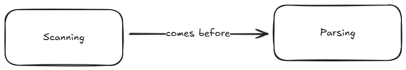

# CMPSC 201: Programming Languages (Fall 2025)

> A study of the fundamental concepts that arise in different programming
language paradigms. Students learn how programming languages are designed and
implemented, and how these factors affect the overall usability, performance,
and effectiveness of computer software. Participating in hands-on activities
that often require teamwork, students gain experience in leveraging the styles
and features of programming languages to implement and evaluate correct and
efficient computer software. During a weekly laboratory session, students use
state-of-the-art technology to complete projects, reporting on their results
through both written documents and oral presentations. Students are invited to
use their own departmentally approved laptop in this course; a limited number of
laptops are available for use during class and lab sessions.

## Textbook: *Crafting Interpreters*

No textbook purchases are required for this course. Rather, this course utilizes
content from the first ten chapters of Robert Nystrom's
[*Crafting Interpreters*](https://craftinginterpreters.com/contents.html), which
is available for free in a webbook format.

## Course Calendar: The Road Ahead

| Week Starting            | Type      | Theme                    | Reading    |
| ------------------------ | --------- | ------------------------ | ---------- |
| 8/26 (no lab)            | Commit    | Orientation              | Chapter 1  |
| 9/1 (no lab)             | Commit    | Parts of a Language      | Chapter 2  |
| 9/8                      | Commit    | Enter Lox                | Chapter 3  |
| 9/15                     | Build     | Language Zoo             | N/A        |
| 9/22                     | Commit    | Scanning                 | Chapter 4  |
| 9/29                     | Commit    | Grammars                 | Chapter 5  |
| 10/6 (no TH class)       | Commit    | Parsing                  | Chapter 6  |
| 10/13                    | Build     | Mission Im-parse-ible    | N/A        |
| 10/20                    | Commit    | Expressions              | Chapter 7  |
| 10/27                    | Commit    | Statements               | Chapter 8  |
| 11/3 (no TU class)       | Commit    | Control Flow             | Chapter 9  |
| 11/10                    | Build     | Locking in Lox           | N/A        |
| 11/17                    | Commit    | Functions                | Chapter 10 |
| 11/24 (no TH class)      | Working   | N/A                      | N/A        |
| 12/1                     | Working   | N/A                      | N/A        |
| 12/8 (exam @ TU, 9am)    | Release   | N/A                      | N/A        |

## Current Week Deliverables (9/1)

Each of the below deliverables are worth one point each on a credit/no credit
basis (i.e., you did the thing by the time it was due, or you didn't).

- **Discord Discussion:** *by Wednesday @ 11:59pm*, post a novel insight
  (meaning something that one of your peers has not already shared) to this
  week's Discord thread about the parts of a language

- **Team Deliverable:** *by Friday @ 7:59pm*, have every team member
  successfully demo a simple `hello world` style Java program for the professor;
  this demo must include both a successful compilation and a successful program
  execution ([this](https://code.visualstudio.com/docs/languages/java) should
  be a useful resource for getting your workspace set up)

- **Individual Deliverable:** *by Friday @ 7:59pm*, demo a toy Java program for
  the professor (and push it to your individual repository); it doesn't matter
  what the program *does*, but the code must include these three things at
  minimum:

  - some form of
    [arithmetic](https://www.w3schools.am/java/java_operators.html#gsc.tab=0)

  - some control flow logic, utilizing either
    [if](https://www.w3schools.am/java/java_conditions.html#gsc.tab=0),
    [while](https://www.w3schools.am/java/java_while_loop.html#gsc.tab=0),
    or [for](https://www.w3schools.am/java/java_for_loop.html#gsc.tab=0)

  - at least one
    [method](https://www.w3schools.am/java/java_methods.html#gsc.tab=0) beyond
    a `main`

- **Reflection Entry:** *by Saturday @ 11:59pm*, within your individual
  repository, add a 200 word (minimum) answer to the following prompt:
  
  > Compare and contrast Python & Java. Tell me about your familiarity with
  > either language, but also talk to me about some of your impressions of
  > what makes the two languages *similar*, as well as what makes them
  > *different*.

- **Mapmaking Task:** *by Saturday @ 11:59pm*, within your individual
  repository, add an image file exported from
  [excalidraw](https://excalidraw.com/) that identifies the eight parts of a
  language identified by Nystrom and visualizes their relationships to one
  another; more specifically, draw eight shapes (one for each part) and ensure
  each shape has at least one arrow noting how it's related to at least one
  other part, like:

  
