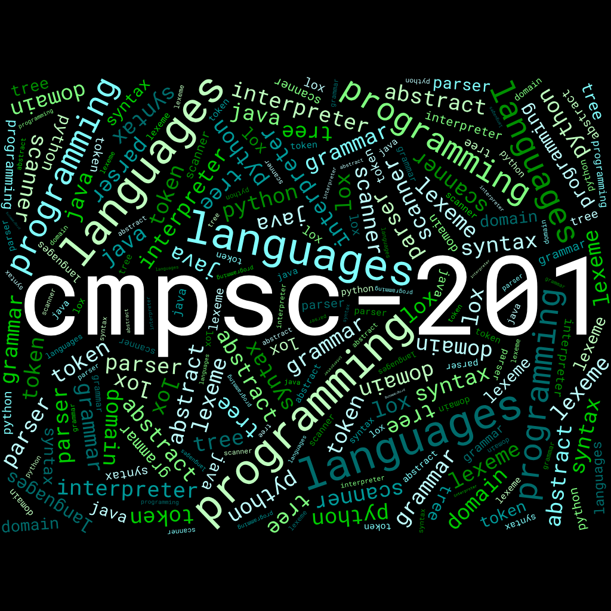
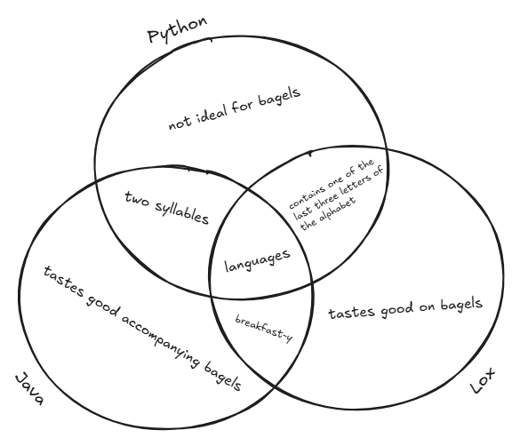

# CMPSC 201: Programming Languages (Fall 2025)

> A study of the fundamental concepts that arise in different programming
language paradigms. Students learn how programming languages are designed and
implemented, and how these factors affect the overall usability, performance,
and effectiveness of computer software. Participating in hands-on activities
that often require teamwork, students gain experience in leveraging the styles
and features of programming languages to implement and evaluate correct and
efficient computer software. During a weekly laboratory session, students use
state-of-the-art technology to complete projects, reporting on their results
through both written documents and oral presentations. Students are invited to
use their own departmentally approved laptop in this course; a limited number of
laptops are available for use during class and lab sessions.

## Textbook: *Crafting Interpreters*

No textbook purchases are required for this course. Rather, this course utilizes
content from the first ten chapters of Robert Nystrom's
[*Crafting Interpreters*](https://craftinginterpreters.com/contents.html), which
is available for free in a webbook format.

## Course Calendar: The Road Ahead

| Week Starting            | Type      | Theme                    | Reading    |
| ------------------------ | --------- | ------------------------ | ---------- |
| 8/26 (no lab)            | Commit    | Orientation              | Chapter 1  |
| 9/1 (no lab)             | Commit    | Parts of a Language      | Chapter 2  |
| 9/8                      | Commit    | Enter Lox                | Chapter 3  |
| 9/15                     | Build     | Language Toy Box         | N/A        |
| 9/22                     | Commit    | Scanning                 | Chapter 4  |
| 9/29                     | Commit    | Grammars                 | Chapter 5  |
| 10/6 (no TH class)       | Commit    | Parsing                  | Chapter 6  |
| 10/13                    | Build     | Mission Im-parse-ible    | N/A        |
| 10/20                    | Commit    | Expressions              | Chapter 7  |
| 10/27                    | Commit    | Statements               | Chapter 8  |
| 11/3 (no TU class)       | Commit    | Control Flow             | Chapter 9  |
| 11/10                    | Build     | Locking in Lox           | N/A        |
| 11/17                    | Commit    | Functions                | Chapter 10 |
| 11/24 (no TH class)      | Working   | N/A                      | N/A        |
| 12/1                     | Working   | N/A                      | N/A        |
| 12/8 (exam @ TU, 9am)    | Release   | N/A                      | N/A        |

## Current Week Deliverables (9/8)

Each of the below deliverables are worth one point each on a credit/no credit
basis (i.e., you did the thing by the time it was due, or you didn't).

- **Discord Discussion:** *by Wednesday @ 11:59pm*, post a novel insight
  (meaning something that one of your peers has not already shared) to this
  week's Discord thread pertaining to one of Nystrom's end-of-chapter challenges

- **Team Deliverable:** *by Thursday @ 12:15pm*, submit a project charter for
  next week's team-based project, which should include:
  
  - Team roles (1 captain, 2 presenters, and 3-4 technical team members)

  - A list of the 5 toys your team will be assembling, including the language
    of implementation and the general function of the toy, keeping in mind that
    each toy must ultimately include:
    
    - At least 3 functions/methods/modules outside of a `main`-esque control
      structure

    - The utilization of at least 3 different data types

    - The capability to accept user input for the sake of facilitating *play*

  - At least two intermediate deadlines per team member

  - A schedule of performance review sessions for 9/15, 9/16, & 9/18

- **Individual Deliverable:** *by Friday @ 7:59pm*, successfully demo a Lox
  version of TheCoolerTeam's banking toy program using
  [this online Lox sandbox](https://www.yanglinzhao.com/posts/crafting-interpreters/)
  and save a copy of your code to your individual repo; hardcode a script that
  hits every option from the original program in whatever order/amounts you
  like, and be sure to display intermediate outputs from every hardcoded user
  selection

- **Reflection Entry:** *by Saturday @ 11:59pm*, within your individual
  repository, add a Markdown (`.md`) file with a 200 word (minimum) response to
  the following prompt:
  
  > Before our performance review sessions next week, you now have a chance to
  > review the instructor regarding the course. Please discuss your experience
  > in this course, and address the following questions: a) how do you feel
  > about the course structure? b) do the commit week deliverables feel like
  > they have educational value? c) does the pace of the course feel about
  > right? d) is there anything the instructor could do to make your time in the
  > course feel better?

- **Mapmaking Task:** *by Saturday @ 11:59pm*, within your individual
  repository, add an image file exported from
  [excalidraw](https://excalidraw.com/) that illustrates a Venn diagram
  comparing and contrasting Python, Java, and Lox in the below style; every
  segment of the diagram must include at least one statement, and the entire
  diagram must include a minimum of twelve comparative statements:

  
