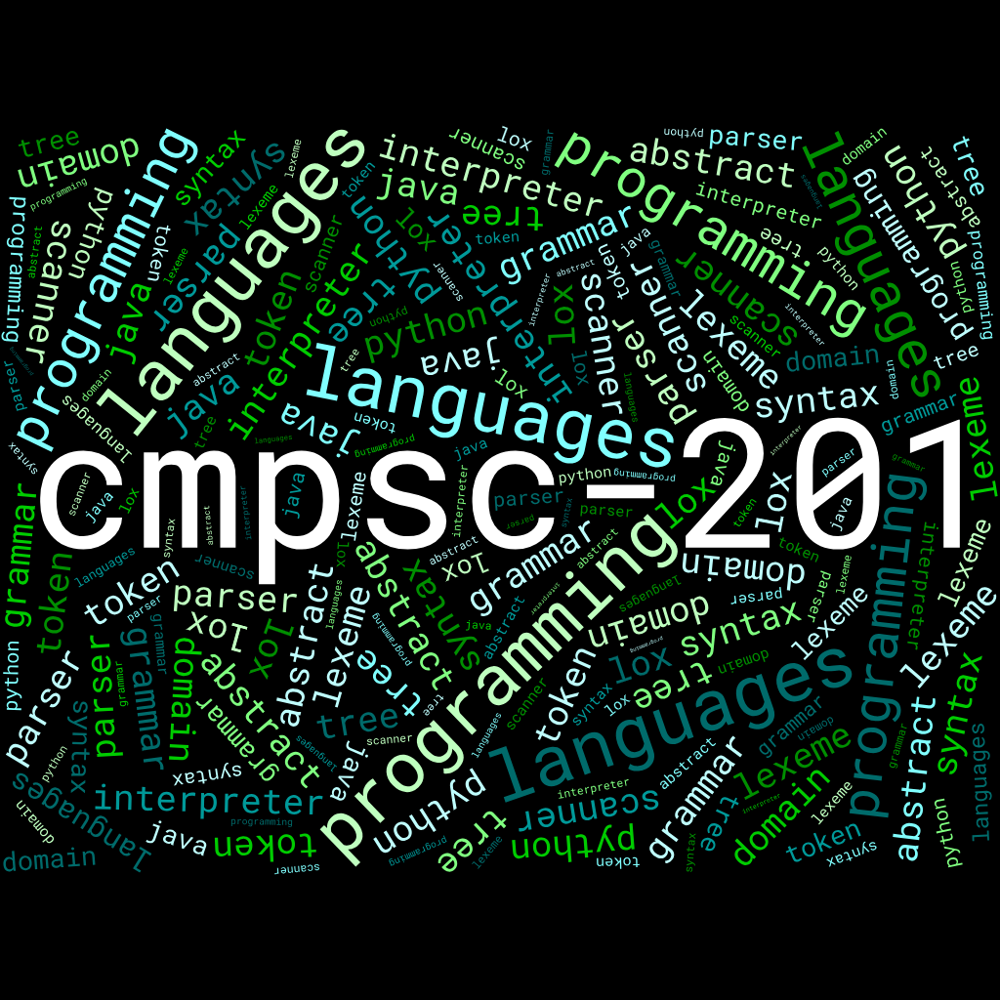

# CMPSC 201: Programming Languages (Fall 2025)

> A study of the fundamental concepts that arise in different programming
language paradigms. Students learn how programming languages are designed and
implemented, and how these factors affect the overall usability, performance,
and effectiveness of computer software. Participating in hands-on activities
that often require teamwork, students gain experience in leveraging the styles
and features of programming languages to implement and evaluate correct and
efficient computer software. During a weekly laboratory session, students use
state-of-the-art technology to complete projects, reporting on their results
through both written documents and oral presentations. Students are invited to
use their own departmentally approved laptop in this course; a limited number of
laptops are available for use during class and lab sessions.

## Office Hours

Given the relatively small population of our course, appointments will not be
necessary; i.e., **all office hours are walk-in only**. That means first come,
first serve.

| Day | Time          |
| :-- | ------------: |
| Wed | 5p - 6p       |
| Fri | 6p - 8p       |

## Textbook: *Crafting Interpreters*

No textbook purchases are required for this course. Rather, this course utilizes
content from the first ten chapters of Robert Nystrom's
[*Crafting Interpreters*](https://craftinginterpreters.com/contents.html), which
is available for free in a webbook format.

## Course Calendar: The Road Ahead

| Week Starting            | Type      | Theme                    | Reading    |
| ------------------------ | --------- | ------------------------ | ---------- |
| 8/26 (no lab)            | Commit    | Orientation              | Chapter 1  |
| 9/1 (no lab)             | Commit    | Parts of a Language      | Chapter 2  |
| 9/8                      | Commit    | Enter Lox                | Chapter 3  |
| 9/15                     | Build     | Language Toy Box         | N/A        |
| 9/22                     | Commit    | Scanning                 | Chapter 4  |
| 9/29                     | Commit    | Grammars                 | Chapter 5  |
| 10/6 (no TH class)       | Commit    | Parsing                  | Chapter 6  |
| 10/13                    | Build     | Tree-Walk Linter         | N/A        |
| 10/20                    | Commit    | Expressions              | Chapter 7  |
| 10/27                    | Commit    | Statements               | Chapter 8  |
| 11/3 (no TU class)       | Commit    | Control Flow             | Chapter 9  |
| 11/10                    | Build     | Lox Interpreter 2.0      | N/A        |
| 11/17                    | Commit    | Functions                | Chapter 10 |
| 11/24 (no TH class)      | Working   | N/A                      | N/A        |
| 12/1                     | Working   | N/A                      | N/A        |
| 12/8 (exam @ TU, 9am)    | Release   | N/A                      | N/A        |

## Culminating Deliverables

- **Performance Review:** for up to five possible points, engage with the
  instructor in a one-on-one conversation during your scheduled session
  checking your knowledge against all five course learning objectives

- **Final Project:** for up to ten possible points, present your team's final
  project on the last day of class, keeping the following in mind:
  
  - Your score will be based off of the rubric your team developed as part of
    the project proposal

  - Your presentation should satisfactorily answer whether you were able to
    answer all ten of the criteria laid out in your rubric

  - Your `release/project-docs` directory should contain a
    `project-reflection.md` that succinctly outlines how the presenters will
    demonstrate the completion of rubric objectives

- **Learning Objective Portfolio:** for up to five possible points, submit the
  portfolio by the end of our exam period (by 11:59am on Tuesday, 12/9), keeping
  the following in mind:

  - **PORTFOLIO DIRECTIONS WILL BE RELEASED DURING THURSDAY'S CLASS**